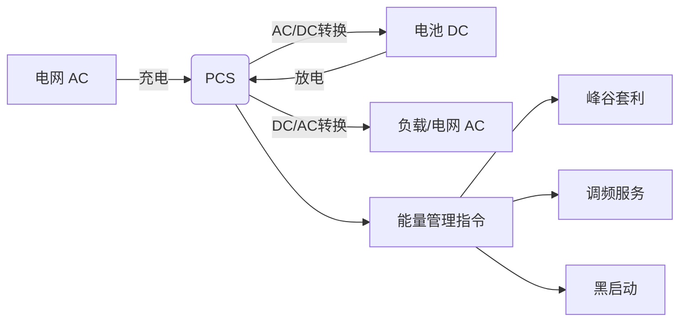
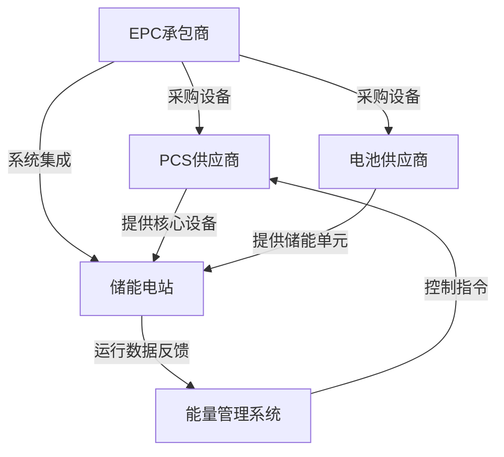
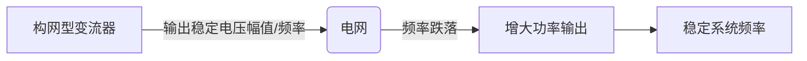
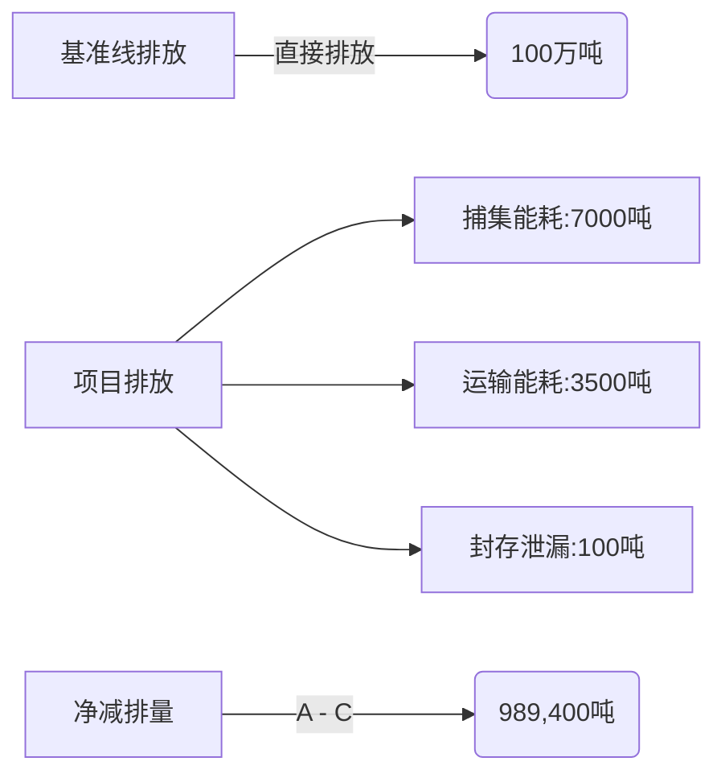
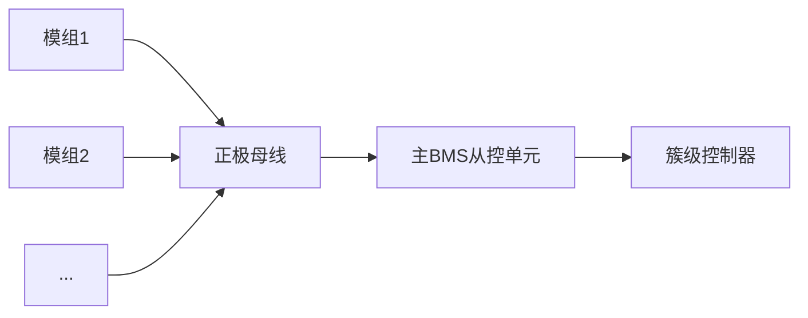

LCOE 与LCOS区别

LCOE（平准化度电成本）与LCOS（平准化储能成本）是能源领域两大关键经济性指标，二者核心差异在于**计算对象和成本构成**。以下是系统对比：

---

### 📊 **核心区别概览**

| **维度**     | **LCOE（平准化度电成本）** | **LCOS（平准化储能成本）**      |
| ---------- | ----------------- | ---------------------- |
| **计算对象**   | 发电设施（如光伏、风电）      | 储能系统（电池、抽水蓄能等）         |
| **功能定位**   | 衡量发电成本（元/kWh）     | 衡量储/放一度电的综合成本（元/kWh）   |
| **成本覆盖范围** | 仅发电成本             | 充放电全周期成本 + 系统损耗 + 寿命衰减 |
| **核心变量**   | 初始投资、运维费、发电量、折现率  | 循环效率、寿命衰减、充放电策略、残值     |

---

### ⚙️ **LCOE（发电侧成本分析）**

**公式**：  

$$
LCOS = \frac{\text{生命周期总成本（投资+运维+充电电费）}}{\text{生命周期总放电量（kWh）}}
$$

**关键构成**：  

1. **投资成本**：设备购置、安装、土地费用  
2. **运维成本**：定期维护、保险、人工  
3. **发电量**：受资源条件（光照/风速）、设备利用率影响  
4. **折现率**：资金时间价值（通常取8%-10%）  

**典型应用场景**：  

- 比较光伏 vs 风电 vs 煤电的发电经济性  
- 评估新建电站投资可行性（如LCOE＜0.3元/kWh的光伏项目具竞争力）

---

### 🔋 **LCOS（储能侧成本分析）**

**公式**：  

$$
LCOS = \frac{\text{生命周期总成本（投资+运维+充电电费）}}{\text{生命周期总放电量（kWh）}}
$$

**关键构成**：  

1. **充电成本**：从电网或新能源购电的费用  
2. **系统损耗**：  
   - 循环效率（80%-95%）：充放电过程的能量损失  
   - 衰减率（年衰减1%-3%）：电池容量随循环次数下降  
3. **寿命终止条件**：当容量衰减至初始容量的70%-80%  
4. **放电策略优化**：峰谷套利、需量管理影响收益  

**典型应用场景**：  

- 测算储能项目回本周期（如LCOS＜峰谷价差则盈利）  
- 对比锂电池 vs 液流电池 vs 压缩空气储能的经济性  

---

### 🌰 **实例对比（以光伏+储能项目为例）**

| **参数**   | 光伏电站（LCOE）    | 锂电池储能（LCOS）   |
| -------- | ------------- | ------------- |
| 初始投资     | 3.5元/W        | 1.2元/Wh       |
| 生命周期     | 25年           | 6000次循环（约10年） |
| 年衰减率     | 0.5%          | 2%            |
| 系统效率     | —             | 90%（充放电损失10%） |
| 运维成本占比   | 1%-2%/年       | 2%-3%/年       |
| **计算结果** | **0.28元/kWh** | **0.52元/kWh** |

💡 **关键结论**：  

该场景下光伏发电成本0.28元/kWh，但经储能调峰后综合用电成本升至 **0.28 + 0.52 = 0.80元/kWh**，需峰谷价差＞0.8元/kWh才能盈利。

---

### 🔍 **为什么LCOS通常高于LCOE？**

1. **能量损耗**：储能充放电存在10%-20%能量损失（如充电1kWh仅放电0.8kWh）  
2. **寿命限制**：电池循环寿命远低于发电设备年限（光伏25年 vs 储能10年）  
3. **额外成本**：充电电费、电池更换费用（部分技术需中期更换）  

---

### 💎 **应用决策价值**

| **场景**     | **优选指标**   | **原因**                |
| ---------- | ---------- | --------------------- |
| 新建新能源电站选址  | LCOE       | 优先选择发电成本最低的区域         |
| 配储项目经济性评估  | LCOS       | 需计算储能增加的真实度电成本        |
| 峰谷套利可行性分析  | LCOS vs 价差 | 当LCOS＜峰谷价差时项目可行       |
| 不同储能技术路线对比 | LCOS       | 反映全生命周期储电成本（含效率与寿命差异） |

**行业趋势**：随着锂电池成本下降（2025年或降至0.6元/Wh）和循环寿命提升（达8000次），LCOS有望降至**0.3-0.4元/kWh**，推动储能全面商业化。

EPC 与PCS 区别，PCS与变流器，变流器的区别

在能源系统（尤其是储能和新能源领域）中，**EPC**、**PCS**、**变流器**是三个关键但易混淆的概念。以下是清晰的技术解析与对比：

---

### 📌 **核心区别速览**

| **术语**  | **全称**                                 | **本质定位**       | **功能范畴**           |
| ------- | -------------------------------------- | -------------- | ------------------ |
| **EPC** | Engineering, Procurement, Construction | **工程项目交付模式**   | 从设计到建成的全流程承包服务     |
| **PCS** | Power Conversion System                | **储能专用电力转换设备** | 实现储能电池与电网之间的双向能量转换 |
| **变流器** | Converter                              | **通用电力电子设备**   | 实现交直流电转换的基础器件      |

---

### ⚙️ **深度解析三者的区别与关联**

#### 1. **EPC（工程总承包）—— 项目交付模式**

- **核心逻辑**：业主将工程项目的 **设计（Engineering）、设备采购（Procurement）、施工（Construction）** 整体外包给承包商。  

- **适用场景**：  
  
  - 储能电站建设（如100MWh锂电池储能项目）  
  - 光伏/风电场建设  

- **承包商责任**：  
  
  - 提供全流程服务，对项目质量、工期、成本总负责  
  - 整合PCS、电池、BMS等设备供应商资源  

- **案例**：  
  
  某200MWh储能电站由阳光电源以EPC模式承建，负责从设计、采购PCS/电池到施工并网的全过程。

#### 2. **PCS（储能变流器）—— 储能系统的“心脏”**

- **核心功能**：  
  
  - **双向能量转换**：在充电时将电网交流电（AC）转为直流电（DC）充入电池，放电时将电池DC转为AC馈入电网。  
  - **并网控制**：调节电压、频率、功率因数以满足电网要求（如低电压穿越）。  
  - **模式切换**：支持并网（Grid-tied）与离网（Island）双模式运行。  

- **技术特性**：  
  
  - 效率：≥97%（高端机型如阳光电源SG2500UX）  
  - 响应速度：毫秒级调节（参与电网调频的关键能力）  

- **与普通变流器的区别**：  
  
  | **维度**    | **PCS（储能变流器）** | **普通变流器（如光伏逆变器）** |
  | --------- | -------------- | ----------------- |
  | **能量流向**  | 双向（充放电）        | 单向（仅DC→AC）        |
  | **控制对象**  | 电池+电网          | 光伏组件/风机           |
  | **功能复杂度** | 支持黑启动、调频调压     | 仅实现并网发电           |

#### 3. **变流器（Converter）—— 电力转换的“基础工具”**

- **广义定义**：实现电能形式转换的任何电力电子设备，包含：  
  - **整流器（AC→DC）**：如手机充电器  
  - **逆变器（DC→AC）**：如光伏逆变器  
  - **变频器（AC→变频AC）**：如电机驱动器  
- **在新能源中的特指**：  
  - 通常指 **光伏逆变器** 或 **风电变流器**（功能单向，仅将新能源发出的直流电转换为交流电并网）。  

---

### 🔋 **PCS在储能系统中的核心作用**

- **关键接口**：连接电池（DC侧）与电网/负载（AC侧）  
- **智能控制**：接收EMS（能量管理系统）指令，动态优化充放电策略  

---

### 🧩 **三者在项目中的协作关系（以储能电站为例）**

- **EPC角色**：整合PCS、电池、BMS等设备，完成电站建设  
- **PCS角色**：执行EMS指令，实现充放电控制与电网交互  
- **变流器角色**：作为PCS的核心组件（含整流+逆变模块）  

---

### 💎 **总结：关键差异与行业术语规范**

1. **EPC是工程模式，PCS是设备，变流器是技术组件**：  
   - EPC属于服务范畴，PCS属于硬件范畴，变流器是PCS的内部功能模块。  
2. **PCS ≠ 普通变流器**：  
   - PCS专为储能设计，具备双向转换、电网支撑等高级功能；普通变流器（如光伏逆变器）仅单向转换。  
3. **行业术语惯例**：  
   - 在储能项目中常说“PCS系统”，在光伏项目中常说“逆变器”，本质是变流器的场景化命名。  

**技术趋势**：新一代PCS正向 **高电压（1500V）**、**多端口集成（光储充一体）**、**构网型（Grid-Forming）** 方向发展，支撑新型电力系统稳定性。

# 构网型与跟网型的区别

在电力系统（尤其新能源并网领域），“构网型”（Grid-Forming）与“跟网型”（Grid-Following）是变流器的两种核心控制策略，其本质区别在于**对电网的支撑能力**和**运行逻辑**。以下是深度解析：

---

### ⚡ **核心区别速览**

| **维度**    | **跟网型 (Grid-Following)** | **构网型 (Grid-Forming)** |
| --------- | ------------------------ | ---------------------- |
| **控制原理**  | 跟随电网电压/频率（如“追随者”）        | 自主建立电压/频率（如“领导者”）      |
| **输出特性**  | 电流源特性                    | 电压源特性                  |
| **电网依赖性** | 依赖电网稳定运行                 | 不依赖电网，可独立组网            |
| **适用场景**  | 强电网环境（传统发电占比高）           | 弱电网/高比例新能源电网（如孤岛微网）    |
| **技术代表**  | 常规光伏逆变器、风电变流器            | 先进储能PCS、虚拟同步机（VSG）     |

---

### 🔧 **深度技术解析**

#### 1. **跟网型 (Grid-Following) — “电网跟随者”**

- **工作原理**：  
  
  - 检测电网电压相位，通过锁相环（PLL）同步自身输出。  
  - 像“电流源”注入功率，其输出电流幅值由功率指令控制，相位跟随电网。  

- **局限性与风险**：  
  
  - **无法自主建立电压/频率**：电网崩溃时自身停机（如电网故障导致频率骤降）。  
  - **引发振荡风险**：在弱电网中，多台PLL设备相互干扰可能导致次同步振荡（如新疆风电基地振荡事故）。  

- **典型应用**：  
  
  集中式光伏电站逆变器，在电网稳定时跟随50Hz频率输出电流。

#### 2. **构网型 (Grid-Forming) — “电网构建者”**

- **工作原理**：  
  - **自主建立电压和频率**：模拟同步发电机行为，通过内部振荡器输出稳定电压波形（无需PLL）。  
  - 像“电压源”提供惯性和阻尼，支撑电网稳定性。  
- **核心优势**：  
  - **黑启动能力**：在电网全黑时率先建立电压，逐步恢复其他电源（如南澳储能电站黑启动）。  
  - **强电网适应性**：在短路比（SCR＜1.5）的弱电网中仍稳定运行。  
  - **提供虚拟惯性**：响应频率变化速率（df/dt），抑制频率波动（如特斯拉储能参与澳洲FCAS调频）。  
- **关键技术**：  
  - 虚拟同步发电机（VSG）、下垂控制（Droop Control）。  

---

### 🌐 **应用场景对比**

| **场景**         | **跟网型适用性** | **构网型必要性** | **原因**             |
| -------------- | ---------- | ---------- | ------------------ |
| **强电网（SCR＞3）** | ✅ 高效低成本    | ⚠️ 非必需     | 电网本身可提供足够惯性        |
| **高比例新能源电网**   | ❌ 可能引发振荡   | ✅ 必须配置     | 新能源缺乏惯性，需构网型提供稳定支撑 |
| **孤岛微网**       | ❌ 无法运行     | ✅ 唯一选择     | 无主网可跟随，需自主建立电压/频率  |
| **黑启动电源**      | ❌ 不可用      | ✅ 核心能力     | 率先重建电网框架           |

**注**：SCR（短路比）= 电网短路容量 / 新能源装机容量，SCR＜1.5定义为弱电网。

---

### 🛠️ **典型案例**

1. **跟网型风险暴露**（英国2019年大停电）：  
   - 海上风电采用跟网型变流器，电网故障时因频率骤降脱机，加剧停电范围。  
2. **构网型成功应用**（南澳Hornsdale储能电站）：  
   - 特斯拉储能PCS启用构网模式，提供惯量响应，将电网频率波动减少90%。  

---

### 🔮 **技术演进趋势**

1. **混合控制策略**：  
   - 新型变流器支持模式切换（如正常时跟网，故障时切换构网）。  
2. **标准强制要求**：  
   - 中国新版《电力系统安全稳定导则》要求新能源场站配置≥10%容量的构网型设备。  
3. **构网型渗透率提升**：  
   - 预计2030年全球构网型储能PCS市场份额超60%（Wood Mackenzie数据）。  

---

### 💎 **总结：选择逻辑**

| **需求**        | **推荐类型** | **原因**           |
| ------------- | -------- | ---------------- |
| 稳定强电网降本       | 跟网型      | 成本低（便宜约15%），控制简单 |
| 高比例新能源并网/孤岛运行 | 构网型      | 避免振荡风险，主动支撑电网    |
| 参与调频辅助服务      | 构网型      | 提供虚拟惯性，补偿收益更高    |

**行业共识**：随着新能源渗透率提升，构网型技术将从“可选”变为“刚需”，成为新型电力系统的稳定基石。

# 碳结算基本逻辑，以及规范，详细的计算过程与计算公式。

碳结算是碳交易市场的核心环节，其本质是通过量化企业/项目的碳排放量或减排量，实现碳资产（配额、减排信用）的分配、交易与清缴。以下从基本逻辑、规范体系、计算方法及案例进行系统解析：

---

### ⚙️ **一、基本逻辑与框架**

1. **核心目标**  
   
   - **控排企业**：政府设定行业排放上限，企业通过减排或购买配额/信用完成履约。  
   - **自愿减排项目**：通过减排活动产生碳信用（如CCER），出售给需抵消排放的企业。  

2. **核算层级**  
   
   - **组织层面**（企业碳盘查）：按“范围1（直接排放）、范围2（外购电力间接排放）、范围3（价值链其他间接排放）”划分边界。  
   - **区域层面**（温室气体清单）：覆盖能源、工业过程、农业、土地利用、废弃物五大领域。  
   - **产品层面**（碳足迹）：全生命周期排放核算（如ISO 14067）。

---

### 📚 **二、核心规范体系**

| **类型**    | **国际规范**                 | **国内规范**                          |
| --------- | ------------------------ | --------------------------------- |
| **企业核算**  | GHG Protocol、ISO 14064-1 | 各行业《企业温室气体排放核算指南》（如发电、钢铁）         |
| **区域核算**  | IPCC 2006国家清单指南          | 《省级温室气体清单编制指南》                    |
| **项目减排量** | CDM方法学                   | 《CCER方法学》+省级标准（如新疆《CCUS碳减排量核算规范》） |
| **配额分配**  | EU ETS基准法                | 全国碳市场《配额分配指南》（历史强度法/基准线法）         |

 注：CCER（中国核证自愿减排量）于2023年重启，项目需符合国家审定方法学。

---

### 📐 **三、计算方法与公式详解**

#### **1. 碳排放量核算**

**(1) 排放因子法（适用最广）**  

$$
\text{排放量} = \text{活动数据} \times \text{排放因子} \times \text{GWP}
$$

- **活动数据**：能源消耗量、产品产量等（如燃煤吨数、用电量）。  
- **排放因子**：单位活动的排放值（如全国电网平均因子0.6101 kgCO₂/kWh）。  
- **GWP**：全球变暖潜势（CO₂=1，CH₄=25，N₂O=298）。  

**案例**：某企业年用电100万kWh，排放量=1,000,000 kWh × 0.6101 kgCO₂/kWh = 610.1吨CO₂。  

**(2) 质量平衡法（高精度工业过程）**  

$$
\text{CO}_2\text{排放量} = (\text{原料含碳量} - \text{产品含碳量}) \times \frac{44}{12}
$$

**案例**：化工企业原料含碳21,871吨，产品含碳9,305吨，排放量=(21,871-9,305)×44/12=46,075吨。  

**(3) 实测法**  

- **CEMS系统**：实时监测烟气CO₂浓度与流速，排放量=浓度×流速×时间。  

#### **2. 碳减排量核算（以CCUS项目为例）**

$$
\text{CO}_2\text{排放量} = (\text{原料含碳量} - \text{产品含碳量}) \times \frac{44}{12}
$$

- **基准线排放**：无项目时的排放量（如直接排入大气）。  
- **项目排放**：捕集能耗（电力排放）+运输能耗+封存泄漏。  
- **泄漏量**：封存CO₂的逃逸率（通常≤0.1%）。  

**案例**：新疆CCUS项目年捕集50万吨CO₂：  

- 基准线排放=100万吨（直接排放）  
- 项目排放=捕集耗电7,000吨 + 运输耗电3,500吨 + 封存泄漏100吨 = 10,600吨  
- 减排量=1,000,000 - 10,600 = 989,400吨。  

---

### 💰 **四、配额分配与交易结算**

#### **1. 配额分配方法**

| **方法**    | **公式**              | **适用行业** | **案例**                             |
| --------- | ------------------- | -------- | ---------------------------------- |
| **历史强度法** | 配额=历史排放强度×减排系数×实际产量 | 电力、建材、造纸 | 天津热电企业：配额=(发电量×单位电排+供热量×单位热排)×0.98 |
| **基准线法**  | 配额=行业基准值×实际产量       | 火电、水泥    | 300MW燃煤机组：配额=供电基准值×供电量×修正系数        |
| **历史排放法** | 配额=历史排放基数×控排系数      | 钢铁、化工    | 天津石化企业：配额=2018年排放量×0.98            |

注：控排系数（如0.98）体现政府“适度从紧”政策导向。

#### **2. 交易结算流程**

1. **初始分配**：免费发放（主）+拍卖（辅），分预配额与补充配额两阶段。  
2. **履约清缴**：企业按实际排放量上缴配额+CCER（抵消比例≤5%）。  
3. **差额处理**：  
   - 配额富余 → 出售或储存至下期；  
   - 配额短缺 → 购买配额或CCER。  

---

### 💎 **五、关键趋势与挑战**

1. **核算精度提升**：CEMS实测逐步替代排放因子法，误差率从±20%降至±5%。  
2. **国际规则接轨**：2025年起试点CBAM（碳边境调节机制），要求出口企业披露产品碳足迹。  
3. **技术创新驱动**：  
   - AI+区块链实现碳数据实时核验；  
   - 省级CCUS核算规范推动碳信用金融化（如新疆标准）。  

> **提示**：企业需建立“监测-报告-核查（MRV）”体系，选择匹配行业的方法学，并关注地方配额调整机制（如天津允许产量增长企业申请配额增发）。

# 储能中，集装箱，簇，package, 电芯，电柜区别

在储能系统中，**电芯（Cell）、Package（模组）、电柜（Rack）、簇（Cluster）、集装箱（Container）** 是不同层级的物理单元，其区别主要体现在**结构层级、电气连接方式及功能定位**上。以下是详细解析：

---

### 📊 **储能系统层级结构与核心区别**

| **层级**      | **单元名称**       | **构成要素**           | **功能定位**           | **典型规模**           |
| ----------- | -------------- | ------------------ | ------------------ | ------------------ |
| **Level 1** | 电芯（Cell）       | 单个电池单元（如方形/圆柱/软包）  | 储能最小单元，提供基础电压/容量   | 3.2V/100Ah（磷酸铁锂）   |
| **Level 2** | 模组（Package）    | 多个电芯串并联+结构框架       | 机械固定、电芯热管理、电压提升    | 16串→51.2V/100Ah    |
| **Level 3** | 电柜（Rack）       | 多个模组串联+电池管理系统（BMS） | 独立充放电单元，簇级管理基础     | 30模组→1536V/300kWh  |
| **Level 4** | 簇（Cluster）     | 1个或多个电柜并联          | 能量调度最小单元，独立接入PCS通道 | 4电柜并联→1536V/1.2MWh |
| **Level 5** | 集装箱（Container） | 多个簇+PCS/温控/消防系统    | 完整储能电站功能单元         | 20簇→24MWh（40尺集装箱）  |

---

### 🔋 **逐级详解与交互逻辑**

#### **1. 电芯（Cell）**

- **物理形态**：锂离子电池基础单元，分方形（CATL）、圆柱（特斯拉4680）、软包（LG）三类。  
- **关键参数**：  
  - 电压：磷酸铁锂（3.2V）、三元锂（3.7V）  
  - 容量：50Ah–300Ah（电力储能常用280Ah）  
- **核心作用**：能量存储的物理载体，性能决定系统寿命（循环次数≥6000次）。

#### **2. 模组（Package）**

- **结构设计**：  
  - 电芯排列：16个电芯串联（如16×3.2V=51.2V）  
  - 附加组件：端板、侧板、导热垫、电压采集线束  
- **功能延伸**：  
  - 机械防护：防止电芯受挤压变形  
  - 热管理接口：预留液冷板通道（如宁德时代CTP模组）  

#### **3. 电柜（Rack）**

- **电气拓扑**：  
  - 30个模组串联（51.2V×30=1536V）→满足PCS直流侧电压要求（1000V–1500V）。  
- **管理核心**：  
  - 柜级BMS：监测模组电压/温度，执行被动均衡（均衡电流≤2A）。  

#### **4. 簇（Cluster）**

- **核心价值**：  
  - **能量调度单元**：每簇独立接入PCS的一个DC/DC变换器通道，实现“簇级管理”。  
  - **解决木桶效应**：各簇充放电策略可差异化（如SOC高的簇优先放电），提升系统可用容量10%+。  
- **典型配置**：  
  - 4个电柜并联 → 电压1536V，容量1.2MWh（300kWh×4）。  

#### **5. 集装箱（Container）**

- **系统集成**：  
  
  | **子系统** | **组件**          | **功能**        |
  | ------- | --------------- | ------------- |
  | 储能单元    | 20簇（每簇1.2MWh）   | 总容量24MWh      |
  | 功率转换    | 4台PCS（每台3MW）    | 交直流转换+并网控制    |
  | 热管理     | 液冷机组（制冷量≥50kW）  | 维持电芯温度25±3℃   |
  | 安全防护    | 可燃气体探测+全氟己酮灭火系统 | 抑制热蔓延         |
  | 本地控制    | EMS柜            | 策略优化（峰谷套利/调频） |

---

### ⚡ **簇级管理（Cluster-Level Control）的技术突破**

传统储能系统因电芯一致性差异导致“木桶效应”（系统容量≈最弱簇容量）。簇级管理通过两项创新解决该问题：

1. **PCS多通道设计**：每簇独立接入DC/DC变换器，支持差异充放电。  

2. **动态能量调度算法**：  
   
   $$
   P_i = P_{total} \times \frac{SOC_i}{\sum_{k=1}^n SOC_k} \quad (i=1,2,\dots,n)
   $$

### 🧩 **典型案例：比亚迪20尺集装箱配置**

| **层级** | 参数配置               | 数量     | 总成参数          |
| ------ | ------------------ | ------ | ------------- |
| 电芯     | 3.2V/304Ah（刀片电池）   | 15,360 | —             |
| 模组     | 16串→51.2V/304Ah    | 960    | —             |
| 电柜     | 15模组串联→768V/304Ah  | 64     | 49kWh/柜       |
| 簇      | 4电柜并联→768V/1216Ah  | 16     | 0.93MWh/簇     |
| 集装箱    | 16簇+3.2MW PCS+液冷系统 | 1      | **14.9MWh/箱** |

> **注**：电芯→集装箱的能量损耗约7%（含PCS转换损耗+温控能耗）。

---

### 💎 **总结：设计选型关键点**

1. **电芯选型**：280Ah以上大容量降低集成复杂度（减少并联数提升一致性）。  
2. **簇规模**：单簇容量1–2MWh为优，平衡PCS通道成本与调度灵活性。  
3. **热管理**：液冷比风冷温差控制精度高50%（电芯温差≤3℃ vs 8℃）。  
4. **安全冗余**：簇级消防（每个电柜独立喷淋）阻断热失控蔓延。  

> **趋势**：新一代储能系统正向 **“Cell to Cluster”** 演进（取消模组/电柜层级），宁德时代麒麟储能、比亚迪魔方系统已实现电芯直接集成至簇，体积利用率提升40%+。
